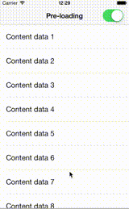
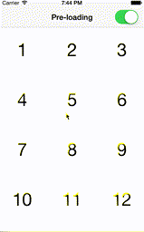

# AWPagedArray

`AWPagedArray` is an [`NSProxy`](https://developer.apple.com/library/ios/documentation/Cocoa/Reference/Foundation/Classes/NSProxy_Class/Reference/Reference.html) subclass which uses an `NSMutableDictionary` as its backbone to provide transparent paging through a standard `NSArray` API.


This means a data provider object can internally populate pages, while the receiver of data is agnostic of how the paging actually works. For objects not yet loaded, the proxy just returns `NSNull` values. 

The class is especially useful for `UITableView`s and `UICollectionView`s which contain paged data from external API's.

## Swift
There is now a Swift equivalent to this data structure simply called [`PagedArray`](https://github.com/MrAlek/PagedArray). Check it out if you're looking to add some fluent paging to your Swift app!

## Installation

### CocoaPods
[CocoaPods](http://cocoapods.org) is the recommended way to add AWPagedArray to your project.

1. Add a pod entry for AWPagedArray to your Podfile `pod 'AWPagedArray', '~> 0.1'`
2. Install the pod(s) by running `pod install`.
3. Include AWPagedArray wherever you need it with `#import "AWPagedArray.h"`.

### Source files

Alternatively you can directly add the `AWPagedArray.h` and `AWPagedArray.m` source files to your project.

1. Download the [latest code version](https://github.com/MrAlek/AWPagedArray/archive/master.zip) or add the repository as a git submodule to your git-tracked project. 
2. Open your project in Xcode, then drag and drop `AWPagedArray.h` and `AWPagedArray.m` onto your project (use the "Product Navigator view"). Make sure to select Copy items when asked if you extracted the code archive outside of your project. 
3. Include AWPagedArray wherever you need it with `#import "AWPagedArray.h"`.

## Usage

```objective-c
_pagedArray = [[AWPagedArray alloc] initWithCount:count objectsPerPage:pageSize];
_pagedArray.delegate = self;
    
[_pagedArray setObjects:objects forPage:1];
```
    
After instantiating the paged array, you set pages with the `setObjects:forPage:` method, while casting the paged array back as an `NSArray` to the data consumer (for example a `UITableViewController`).

```objective-c
// DataProvider.h
@property (nonatomic, readonly) NSArray *dataObjects;

// DataProvider.m
- (NSArray *)dataObjects {
  return (NSArray *)_pagedArray;
}
```

Through the `AWPagedArrayDelegate` protocol, the data provider gets callbacks when data is access from the paged array. This way, the data provider can start loading pages as soon as an `NSNull` value is being accessed or preload the next page if the user starts to get close to an empty index.

```objective-c
- (void)pagedArray:(AWPagedArray *)pagedArray
   willAccessIndex:(NSUInteger)index
      returnObject:(__autoreleasing id *)returnObject {

  if ([*returnObject isKindOfClass:[NSNull class]] && self.shouldLoadAutomatically) {
    [self setShouldLoadDataForPage:[pagedArray pageForIndex:index]];
  } else {
    [self preloadNextPageIfNeededForIndex:index];
  }
}
```
    
Since the delegate is provided with a reference pointer to the return object, it can also dynamically change what gets returned to the consumer. For instance, replace the `NSNull` placeholder object with something else.

## Demo

The included demo project shows an example implementation of a data provider using an `AWPagedArray`, populating a UITableViewController and a UICollectionViewController with the fluent pagination technique as described in [this blogpost](http://www.iosnomad.com/blog/2014/4/21/fluent-pagination).




## Tests

AWPagedArray is covered with XCUnit tests which can be found in the `Tests` folder.

There are currently `19` tests implemented.

## Licence

This code is distributed under the terms and conditions of the [MIT license](LICENSE).
